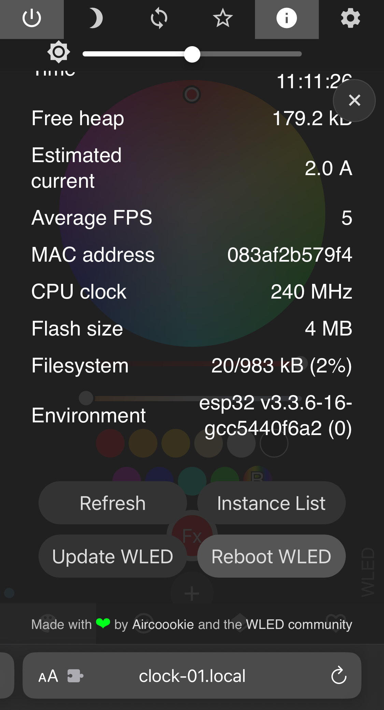

Leutenegger, Sabine. Clock, *Studio for Immediate Spaces Graduation Show 2024.* Photograph. June, 2024.

# Tech Stack
## Hardware
- 100 RGB LED WS2812B mini PCBs
- 6x WorldSemi WS2812B Digitale 5050 RGB LED 32x8 Matrix
- 2x Raspberry Pi (3 B+ and 4 1GB)
- 4x Joy-it SBC-NodeMCU-ESP32
- TP-Link Archer MR200 Wifi Router
- Various power supplies, cabeles, and so on… (wip)

## Software
- WLED Version 0.15.0-b3
- MQTT Broker (Mosquitto)
- Raspberry Pi OS
- Express Node.js Server with native Twig HTML Forms

# How to use
Excuse me for the spaghetti code. It had to be done, rather than beautiful.

## Deployment on Raspberry Pi (made with 3 B+)
Note: incomplete

1. Connect through SSH
2. Setup MQTT broker and make sure to start a service on boot ([Mosquitto](https://mosquitto.org/download/) [Nice Tutorial](https://randomnerdtutorials.com/how-to-install-mosquitto-broker-on-Raspberry-pi/))
2. If SSH keys are not installed yet, navigate to the .ssh directory (`cd ~/.ssh`) and generate some with `ssh-keygen -t ed25519 -C "your_email@example.com"` and add publickey as a deployment key in your repository (fork it repository first).
3. **Optionally**, you can paste your computers public key to `authorized_keys` in the folder (or create it with `nano authorized_keys`).
3. Clone the repository
4. [Install nvm](https://www.jemrf.com/pages/how-to-install-nvm-and-node-js-on-raspberry-pi)
5. Navigate into repository folder
6. Install and use correct npm version with `nvm use`
7. Copy and rename `.env.example` to `.env`, and add correct values to `.env`
8. Install dependencies `npm install`
9. Test with `npm run dev`
10. Install pm2 globally with `npm install -g pm2` (to run the script on startup)
11. `pm2 startup`
12. Paste in the resulting command as instructed.
13. Type `pm2 start ./bin/www`
14. `pm2 save`
15. Reboot Raspberry Pi and test if webapp is running on `https://raspberrypi.local/api`
16. Alternatively, there is a .service file that somebody could make work
17. Set the time on the Raspberry Pi with the countdown correctly by either connecting to the internet and chosing a time server or by setting it manually with `sudo date -s '2021-01-04 13:04:00'`

## Hardware usage

### ESP Mapping (Microcontrollers)
| Number | Displays | MQTT Topic | Settings URL | Config File |
| --- | --- | --- | --- | --- |
| 1 | Circle | wled/circle | http://clock-01.local | [clock-01_cfg.json](wledconfigs/clock-01_cfg.json) |
| 2 | Solar Flares | wled/solarflares | http://clock-02.local | [clock-02_cfg.json](wledconfigs/clock-02_cfg.json) |
| 3 | Value | wled/value | http://clock-03.local | [clock-03_cfg.json](wledconfigs/clock-03_cfg.json) |
| 4 | Countdown | wled/countdown | http://clock-04.local | [clock-04_cfg.json](wledconfigs/clock-04_cfg.json) |

### Control Webinterface

1. Connect with the SIS2024 Wifi
2. Go to http://raspberrypi.local:9000/api

### Reboot & Update code

If you change the code of your server, you only need to restart the running process on the Raspberry Pi without the need to reboot it completely. For that, access the Raspberry Pi with SSH, navigate to the project folder (maybe that's not even needed) and type `pm2 restart 0` wheras the 0 stands for the ID of the service. If not sure what's the ID, type `pm2 list` and read from the list.

It is very likely that when the Raspberry Pi is turned off once and restarted, the microcontrollers need to be rebooted after that as well before they receive new data.

To reboot the Raspberry Pi, login with SSH and run `sudo reboot`.

#### LED Microcontroller

1. Connect with Wifi
2. Open Microntroller URL (see ESP Mapping table)
3. Tab on the information icon (i)
4. Scroll to the bottom and press the reboot button
5. Confirm
6. Wait until the microcontroller is back up

#### Raspberry Pi with Servers and Webinterface

1. Connect laptop to Wifi
2. Open “Terminal” app on Macos
3. Type `ssh sis@raspberrypi.local`
4. Enter password
5. Enter `sudo reboot`
6. Wait until Raspberry Pi is back up

## Note on Mosquitto MQTT Broker
Somehow, the a forth channel created issues with the performance while blocking another channel that was updated frequently. Therefore, we added an additional Raspberry Pi with the same setup but without all the channels running on them. This way, a Raspberry Pi can also be rebooted without the whole clock turning off.

# Contributors
- Enno Pötschke ([http://ennopoetschke.com](http://ennopoetschke.com), [@enno.poetschke](https://www.instagram.com/enno.poetschke/))
- Lucas de Montalembert ([@lucasmontalembert](https://www.instagram.com/lucasmontalembert/))
- Vinzenz Leutenegger ([https://vinze.nz](http://vinze.nz), [@znezniV](https://github.com/znezniV) [@znezniV](https://www.instagram.com/znezniv/))
- Zhiyi Cao ([https://zhiyicao.co/](https://zhiyicao.co/), [@zyc.revisionaire](https://www.instagram.com/zyc.revisionaire/))
